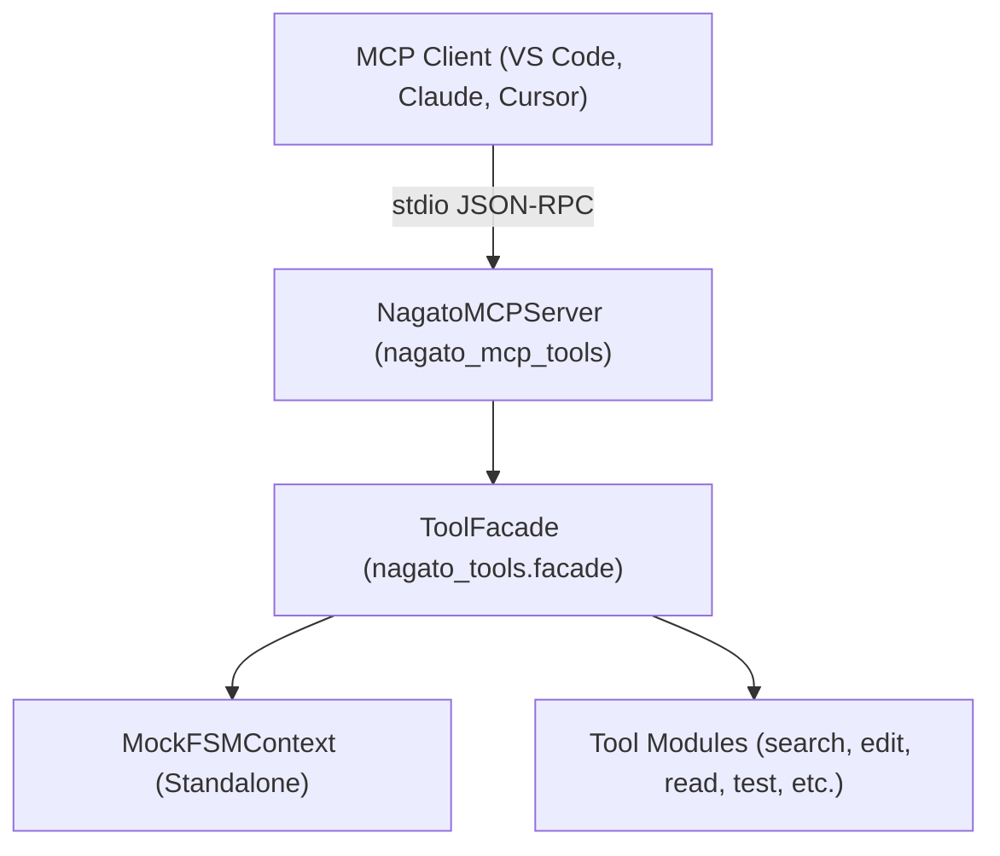

# 🛠️ nagato-mcp-tools

[](https://www.python.org/downloads/)
[](https://modelcontextprotocol.io/)
[](LICENSE)
[](https://github.com/Chromoforge/nagato-mcp-tools)

> **Agent-First MCP Toolkit** — 31 code search, editing, execution, and analysis tools exposed directly over the [Model Context Protocol (MCP)](https://modelcontextprotocol.io/). Fully standalone and compatible with any MCP client (VS Code, Claude Desktop, Cursor, etc.).
>
> Licensed under the **MIT License**. See [LICENSE](LICENSE) for full terms.

---

## ✨ Features

- 🔍 **Deep Code Navigation:** AST-level symbol extraction, call-graph analysis (callers/callees), function signatures, file discovery, and vector-based semantic code search.
- ✏️ **Precise Code Editing:** Exact substring replacements, line-range edits, safe renames/deletes.
- ⏪ **Granular Undo/Redo:** Multi-mode undo/redo (steps, time, command, step-target) — rollback edits, shell commands, or entire workflows with precision.
- ⚡ **Execution & Scripting:** Python code snippet execution with timeout limits and isolated subprocess execution (Note: NOT an OS sandbox; executes with local user permissions).
- 🧪 **Testing & Quality:** Targeted pytest execution (`nagato_run_test`), configured test suites, and integrated Ruff linting/syntax checks.
- 🧰 **Git & Shell:** Git log/diff/status/revert, shell execution, DuckDuckGo web search, and interactive prompts.
- 🧠 **Smart Pre-Parsing:** Automatic input validation and auto-correction before tool execution — catches malformed arguments early.

---

## ⚠️ Security & Trust Model

* **No Sandbox:** `nagato_execute_snippet` and `nagato_shell` execute with full user permissions on the host system. Do not expose them to untrusted external LLM prompts without human oversight.
* **WebUI Security:** The WebUI dashboard has no built-in authentication. Bind it only to `127.0.0.1` / `localhost` and do not expose the port to public networks.
* **Audit Logs:** Tool calls and returns are logged to `.nagato/standalone/audit.jsonl`. If inspecting files containing sensitive tokens/credentials, consider adding `.nagato/` to your `.gitignore`.

---

## 📦 Installation

### Standard Installation
```bash
pip install nagato-mcp-tools
```

### With Semantic Search (Vector Embeddings)
```bash
pip install "nagato-mcp-tools[semantic]"
```

### With WebUI Dashboard (Live Monitoring & Audit)
```bash
pip install "nagato-mcp-tools[ui]"
```

### All Extras (Semantic + WebUI)
```bash
pip install "nagato-mcp-tools[semantic,ui]"
```

### Editable Installation (Development)
```bash
git clone https://github.com/Chromoforge/nagato-mcp-tools.git
cd nagato-mcp-tools
pip install -e ".[dev,ui,semantic]"
```

---

## 🚀 Quick Start

### 1. Stdio MCP Server
Start the stdio MCP server directly from your terminal for any MCP client:

```bash
# Uses current directory as workspace root and default "standalone" session
nagato-mcp-tools

# Specify a custom workspace directory
nagato-mcp-tools --workspace /path/to/your/project

# Multi-project isolation via session ID
nagato-mcp-tools --workspace /path/to/your/project --session-id proj:my-app
# Or via environment variable:
export NAGATO_SESSION_ID="proj:my-app"
nagato-mcp-tools
```

### 2. Standalone WebUI Dashboard
Start the visual dashboard and telemetry server (`pip install "nagato-mcp-tools[ui]"`):

```bash
# Start dashboard on http://127.0.0.1:8080 and open browser
nagato-ui --open-browser

# Specify custom host, port, workspace, and project session
nagato-ui --workspace /path/to/your/project --session-id proj:my-app --port 8085
```

---

## 🗂️ Multi-Project & Session Isolation

When using Nagato tools across multiple repositories/projects, you can prevent cross-project pollution using **formatted `session_id` values**:

* **Project Session**: `proj:<project-name>` (e.g. `proj:backend-api`, `proj:mobile-app`) — isolates audit telemetry and undo snapshots per project.

* **Default Session**: `standalone` (fallback) — single-workspace zero-config default.
* **FSM Ephemeral Session**: Standard UUID4 (e.g. `550e8400-e29b-41d4...`) — managed turn-by-turn orchestration.

All colons, slashes, and illegal path characters in formatted session IDs are automatically sanitized for cross-platform filesystem safety. For example, `proj:my-app` becomes `proj_my-app` on disk. The rewrite is **silent by default**; if you need to see exactly which session IDs are being rewritten, set one of these environment variables before launching the server:

```bash
# Linux / macOS / WSL
export NAGATO_LOG_SESSION_SANITIZE=1
# Or, more broadly (toggles all nagato debug logging):
export NAGATO_DEBUG=1

# Windows PowerShell
$env:NAGATO_LOG_SESSION_SANITIZE = "1"
```

On startup with the toggle on, the standalone router logs a line like:

```
[nagato] standalone router ready: session_id='proj_my-app' (raw='proj:my-app') workspace=/path/to/project
[nagato] session-id sanitized: 'proj:my-app' -> 'proj_my-app'
```

---

## 🔌 Client Configuration

### 1. VS Code (`.vscode/mcp.json`)
```json
{
  "servers": {
    "nagato-tools": {
      "type": "stdio",
      "command": "nagato-mcp-tools",
      "args": [
        "--workspace", "${workspaceFolder}",
        "--session-id", "proj:my-app"
      ]
    }
  }
}
```

### 2. Claude Desktop (`claude_desktop_config.json`)
```json
{
  "mcpServers": {
    "nagato-tools": {
      "command": "nagato-mcp-tools",
      "args": [
        "--workspace", "/path/to/your/project",
        "--session-id", "proj:my-app"
      ],
      "env": {
        "NAGATO_SESSION_ID": "proj:my-app"
      }
    }
  }
}
```

### 3. Cursor / Windsurf
Add a new stdio MCP server:
- **Command:** `nagato-mcp-tools`
- **Args:** `["--workspace", ".", "--session-id", "proj:my-app"]`

---

## 🤖 Agent Instructions & Prompt Setup

To get the most out of `nagato-mcp-tools`, your AI assistant (Copilot, Cursor, Claude Code, etc.) needs instructions on **how** and **when** to leverage AST navigation, safe edit loops, and undo capabilities.

Copy the included **[`AGENT_INSTRUCTIONS.md`](AGENT_INSTRUCTIONS.md)** into your project configuration:

- **VS Code:** `.github/copilot-instructions.md`
- **Cursor:** `.cursorrules` or `.cursor/rules/nagato.mdc`
- **Claude Code / Claude Desktop:** `CLAUDE.md` or System Prompt
- **Windsurf:** `.windsurfrules`

The instructions guide the LLM to:
1. **Explore first:** Use `nagato_read_signatures` and `nagato_searchAST` instead of reading entire files into context.
2. **Safe edits:** Make surgical edits with `nagato_edit`, immediately run `nagato_lint`, and verify tests.
3. **Rollback easily:** Use `nagato_undo_standalone` if changes fail instead of doing messy manual reversions.
4. **Insight Architecture:** Keep track of dependencies with `nagato_view_radar` and `nagato_sync_ast_to_insight`.

---

## 🛠️ Registered Tools (31 Tools)

| Category | Available Tools | Description |
|---|---|---|
| **Search** | `nagato_searchAST`<br>`nagato_searchInFile`<br>`nagato_searchInFiles`<br>`nagato_find_file`<br>`nagato_semantic_search`<br>`nagato_rebuild_symbol_db`<br>`nagato_set_semantic_search_root` | Search symbols via AST, plain substring search in single/multiple files, filename lookup, and vector semantic search. |
| **Inspection** | `nagato_read_file`<br>`nagato_read_lines`<br>`nagato_list_dir`<br>`nagato_read_signatures`<br>`nagato_extract_callees`<br>`nagato_extract_callers` | Inspect file content and line ranges, extract signatures, and inspect call graphs (callers & callees). |
| **Editing** | `nagato_edit`<br>`nagato_edit_lines`<br>`nagato_delete`<br>`nagato_rename`<br>`nagato_create_dir` | Target exact string replacement, line-range editing, rename/delete files, create directories. |
| **Undo/Redo** | `nagato_undo_standalone` | Granular undo/redo with multi-mode support (steps, time, command, step-target). |
| **Execution** | `nagato_execute_snippet` | Execute Python snippets with subprocess isolation and timeout limits. |
| **Lint & Quality** | `nagato_lint` | Syntax checking and automated Ruff linting. |
| **Testing** | `nagato_run_test`<br>`nagato_run_gold_full`<br>`nagato_run_configured_suite` | Run single pytest test nodes or configured test suites. |
| **Git** | `nagato_git`<br>`nagato_upload` | Git operations (diff, log, status, revert, checkout) and guarded uploads. |
| **Shell** | `nagato_shell`<br>`nagato_shell_str` | Shell command execution (string and structured output). |
| **Web** | `nagato_web_search` | DuckDuckGo web search. |
| **System** | `nagato_is_agent_running` | Agent monitoring. |
| **Creation** | `nagato_generate_uuid4` | UUID generation for session bootstrap. |

---

## 🌐 WebUI Dashboard

The package includes a built-in React/Vite dashboard SPA for visual debugging, real-time audit event streaming, token tracking, and interactive inspection of tool executions and undo/redo history.

### Quick Start
Install the `[ui]` extra and run `nagato-ui`:

```bash
pip install "nagato-mcp-tools[ui]"
nagato-ui --workspace . --port 8080 --open-browser
```

### Features
- 📊 **Real-Time Audit Stream**: Live WebSocket event stream of tool dispatches, execution durations, and payloads.
- ⏪ **Undo/Redo Browser**: Visual timeline of file modifications, creations, and deletions with instant rollback status.
- 🪙 **Token Usage Tracking**: Aggregated prompt/completion tokens and interaction breakdown.
- 🔍 **Overview & Health**: Consolidated workspace telemetry metrics and health checks.
- 🔌 **Standalone REST API**: HTTP endpoints (`/api/v1/standalone/*`) for external scripts or custom frontends.

### Building the WebUI from Source
```bash
# From repository root
cd dashboard
npm install
npm run build
# Or sync directly:
python sync_tools.py --build-ui
```

---

## 🔧 Tool Filtering

Control which tools are available via:

### 1. Config File (`.nagato/standalone.yaml`)
```yaml
# .nagato/standalone.yaml
allowed_categories: ["READ", "SEARCH", "EXECUTE"]
denied_tools: ["nagato_shell", "nagato_git", "nagato_upload"]
# allowed_tools: ["nagato_read_file", "nagato_searchInFile"]  # Alternative: explicit allowlist
```

**Category names** match `ToolCategory` enum: `EDIT`, `TESTING`, `GIT`, `SEARCH`, `WEB`, `READ`, `EXECUTE`, `DEBUGGING`, `SYSTEM`, `SHELL`, `CREATION`, `PLANNING`.

### 2. Explicit Parameters (Override Config)
```python
from nagato_tools.facade import create_standalone_facade
from nagato_tools.tool_categories import ToolCategory

# Explicit params override config file
facade = create_standalone_facade(
    allowed_tools={"nagato_read_file", "nagato_searchInFile"},
    denied_tools={"nagato_shell"},
    allowed_categories=[ToolCategory.READ, ToolCategory.SEARCH],
)
```

### 3. Runtime Control
```python
from nagato_tools.facade import create_standalone_facade

facade = create_standalone_facade()

# Disable/enable individual tools
facade.disable_tool("nagato_shell")
facade.enable_tool("nagato_shell")

# Disable/enable entire categories
facade.disable_category(ToolCategory.SHELL)
facade.enable_category(ToolCategory.READ)

# Custom filter predicate
facade.set_tool_filter(lambda name: not name.startswith("nagato_delete"))

# Inspect current filter status
print(facade.get_filter_status())
```

### Filter Precedence
1. **`denied_tools`** — Absolute block (wins over everything)
2. **`allowed_tools`** — Explicit allowlist (if set, only these tools)
3. **`allowed_categories`** — Category-level allowlist
4. **Default** — All discovered tools

---

## ⚙️ Configuration (`.nagato/functions_config.json`)

Standalone tool behaviors (Semantic Search, Ruff Linting, and Nagato Insight Knowledge Graph) are configured per-workspace via `.nagato/functions_config.json`. Place this file inside the `.nagato/` folder of your project root:

```json
{
  "insight": {
    "enabled": true,
    "embedding_provider": "fastembed",
    "embedding_model": "jinaai/jina-embeddings-v2-base-code",
    "embedding_dimension": 768
  },
  "semantic_search": {
    "db_path": "nagato_codebase.db",
    "embedding_model": "jina",
    "dimension": 768,
    "auto_index": true
  },
  "lint": {
    "enabled": true,
    "soft_mode": true,
    "auto_fix": false,
    "ruff_path": "ruff"
  }
}
```

> **Note on Insight**: In standalone MCP Tools builds with Insight enabled, Insight is **disabled by default** until explicitly enabled in `.nagato/functions_config.json` via `"insight": {"enabled": true}`. When enabled, AST background synchronization runs automatically on edits (`nagato_edit`, `nagato_edit_lines`) and populates the local knowledge graph.

---


---

## 🧠 Semantic Search (Optional)

Semantic search uses `fastembed` (embeddings) and `sqlite-vec` (vector database).

1. Install semantic extras:
   ```bash
   pip install "nagato-mcp-tools[semantic]"
   ```
2. Build the vector database by calling `nagato_rebuild_symbol_db` from your MCP client.
3. For model choices (Jina vs. BAAI) and database configuration, see [SEMANTIC_SEARCH_SETUP.md](SEMANTIC_SEARCH_SETUP.md).

---

## 🏗️ Architecture



---

## 🧪 Development & Testing

```bash
# Run test suite
pytest

# Run tests with coverage
pytest --cov=nagato_tools --cov=nagato_mcp_tools
```

---

## 📄 License

Distributed under the [MIT License](LICENSE).