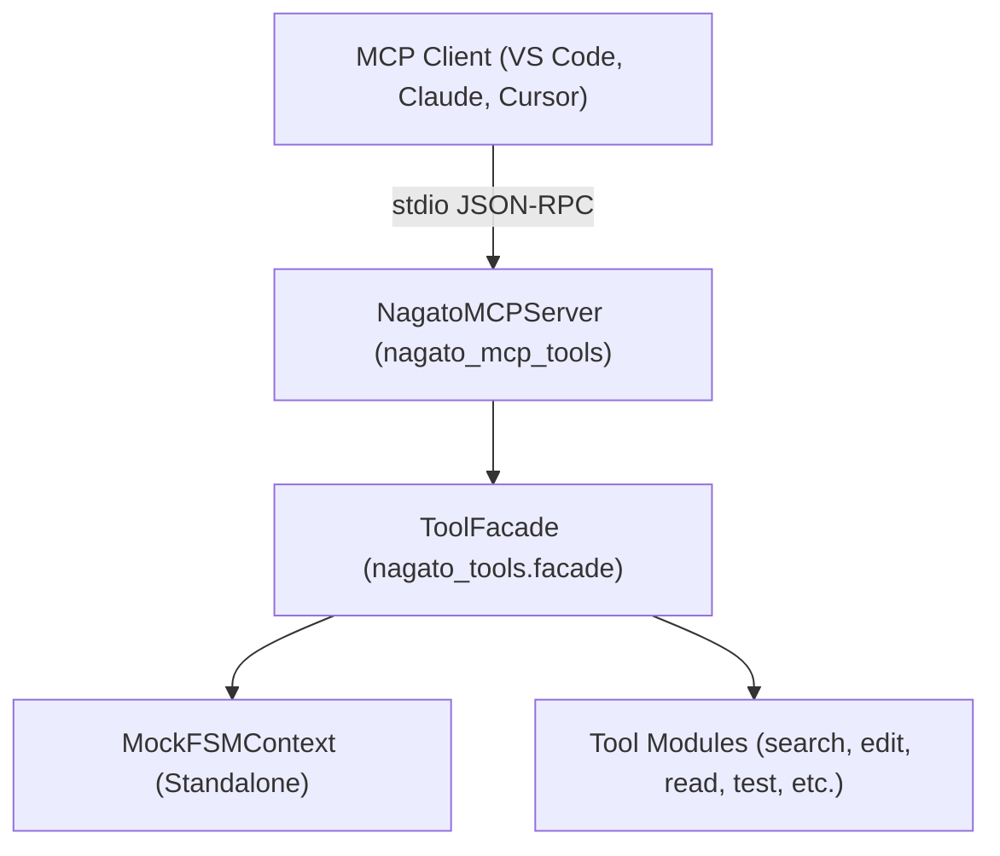

# 🛠️ nagato-mcp-tools

[](https://www.python.org/downloads/)
[](https://modelcontextprotocol.io/)
[](LICENSE)

> **Agent-First MCP Toolkit** — 33 code search, editing, execution, and analysis tools exposed directly over the [Model Context Protocol (MCP)](https://modelcontextprotocol.io/). Fully standalone and compatible with any MCP client (VS Code, Claude Desktop, Cursor, etc.).

---

## ✨ Features

- 🔍 **Deep Code Navigation:** AST-level symbol extraction, call-graph analysis (callers/callees), function signatures, file discovery, and vector-based semantic code search.
- ✏️ **Precise Code Editing:** Exact substring replacements, line-range edits, safe renames/deletes.
- ⏪ **Granular Undo/Redo:** Multi-mode undo/redo (steps, time, command, step-target) — rollback edits, shell commands, or entire workflows with precision.
- ⚡ **Execution & Sandbox:** Sandboxed Python code execution with AST safety validation and timeout limits.
- 🧪 **Testing & Quality:** Targeted pytest execution (`nagato_run_test`), configured test suites, and integrated Ruff linting/syntax checks.
- 🧰 **Git & Shell:** Git log/diff/status/revert, shell execution, DuckDuckGo web search, and interactive prompts.
- 🧠 **Smart Pre-Parsing:** Automatic input validation and auto-correction before tool execution — catches malformed arguments early.

---

## 📦 Installation

### Standard Installation
```bash
pip install nagato-mcp-tools
```

### With Semantic Search (Vector Embeddings)
```bash
pip install "nagato-mcp-tools[semantic]"
```

### Editable Installation (Development)
```bash
git clone https://github.com/your-username/nagato-mcp-tools.git
cd nagato-mcp-tools
pip install -e ".[dev]"
```

---

## 🚀 Quick Start

Start the stdio MCP server directly from your terminal:

```bash
# Uses current directory as workspace root
nagato-mcp-tools

# Or specify a custom workspace directory
nagato-mcp-tools --workspace /path/to/your/project
```

---

## 🔌 Client Configuration

### 1. VS Code (`.vscode/mcp.json`)
```json
{
  "servers": {
    "nagato-tools": {
      "type": "stdio",
      "command": "nagato-mcp-tools",
      "args": ["--workspace", "${workspaceFolder}"]
    }
  }
}
```

### 2. Claude Desktop (`claude_desktop_config.json`)
```json
{
  "mcpServers": {
    "nagato-tools": {
      "command": "nagato-mcp-tools",
      "args": ["--workspace", "/path/to/your/project"]
    }
  }
}
```

### 3. Cursor / Windsurf
Add a new stdio MCP server:
- **Command:** `nagato-mcp-tools`
- **Args:** `["--workspace", "."]`

---

## 🛠️ Registered Tools (34 Tools)

| Category | Available Tools | Description |
|---|---|---|
| **Search** | `nagato_searchAST`<br>`nagato_searchInFile`<br>`nagato_searchInFiles`<br>`nagato_find_file`<br>`nagato_semantic_search`<br>`nagato_rebuild_symbol_db`<br>`nagato_set_semantic_search_root` | Search symbols via AST, plain substring search in single/multiple files, filename lookup, and vector semantic search. |
| **Inspection** | `nagato_read_file`<br>`nagato_read_lines`<br>`nagato_list_dir`<br>`nagato_read_signatures`<br>`nagato_extract_callees`<br>`nagato_extract_callers` | Inspect file content and line ranges, extract signatures, and inspect call graphs (callers & callees). |
| **Editing** | `nagato_edit`<br>`nagato_edit_lines`<br>`nagato_delete`<br>`nagato_rename` | Target exact string replacement, line-range editing, rename/delete files. |
| **Undo/Redo** | `nagato_undo_standalone` | Granular undo/redo with multi-mode support (steps, time, command, step-target). |
| **Execution** | `nagato_execute_snippet` | Execute Python snippets with AST security checks and timeout limits. |
| **Lint & Quality** | `nagato_lint` | Syntax checking and automated Ruff linting. |
| **Testing** | `nagato_run_test`<br>`nagato_run_gold_full`<br>`nagato_run_configured_suite` | Run single pytest test nodes or configured test suites. |
| **Debug** | `nagato_inspect_line` | Line inspection with context. |
| **Git** | `nagato_git`<br>`nagato_upload` | Git operations (diff, log, status, revert, checkout) and guarded uploads. |
| **Shell** | `nagato_shell`<br>`nagato_shell_str` | Shell command execution (string and structured output). |
| **Web** | `nagato_web_search` | DuckDuckGo web search. |
| **System** | `nagato_error`<br>`nagato_is_agent_running` | Error reporting and agent monitoring. |
| **Creation** | `nagato_generate_uuid4` | UUID generation for session bootstrap. |

---

## 🔧 Tool Filtering

Control which tools are available via:

### 1. Config File (`.nagato/standalone.yaml`)
```yaml
# .nagato/standalone.yaml
allowed_categories: ["READ", "SEARCH", "EXECUTE"]
denied_tools: ["nagato_shell", "nagato_git", "nagato_upload"]
# allowed_tools: ["nagato_read_file", "nagato_searchInFile"]  # Alternative: explicit allowlist
```

**Category names** match `ToolCategory` enum: `EDIT`, `TESTING`, `GIT`, `SEARCH`, `WEB`, `READ`, `EXECUTE`, `DEBUGGING`, `SYSTEM`, `SHELL`, `CREATION`, `PLANNING`.

### 2. Explicit Parameters (Override Config)
```python
from nagato_tools.facade import create_standalone_facade
from nagato_tools.tool_categories import ToolCategory

# Explicit params override config file
facade = create_standalone_facade(
    allowed_tools={"nagato_read_file", "nagato_searchInFile"},
    denied_tools={"nagato_shell"},
    allowed_categories=[ToolCategory.READ, ToolCategory.SEARCH],
)
```

### 3. Runtime Control
```python
from nagato_tools.facade import create_standalone_facade

facade = create_standalone_facade()

# Disable/enable individual tools
facade.disable_tool("nagato_shell")
facade.enable_tool("nagato_shell")

# Disable/enable entire categories
facade.disable_category(ToolCategory.SHELL)
facade.enable_category(ToolCategory.READ)

# Custom filter predicate
facade.set_tool_filter(lambda name: not name.startswith("nagato_delete"))

# Inspect current filter status
print(facade.get_filter_status())
```

### Filter Precedence
1. **`denied_tools`** — Absolute block (wins over everything)
2. **`allowed_tools`** — Explicit allowlist (if set, only these tools)
3. **`allowed_categories`** — Category-level allowlist
4. **Default** — All discovered tools


---

## 🧠 Semantic Search (Optional)

Semantic search uses `fastembed` (embeddings) and `sqlite-vec` (vector database).

1. Install semantic extras:
   ```bash
   pip install "nagato-mcp-tools[semantic]"
   ```
2. Build the vector database by calling `nagato_rebuild_symbol_db` from your MCP client.
3. For model choices (Jina vs. BAAI) and database configuration, see [SEMANTIC_SEARCH_SETUP.md](SEMANTIC_SEARCH_SETUP.md).

---

## 🏗️ Architecture



---

## 🧪 Development & Testing

```bash
# Run test suite
pytest

# Run tests with coverage
pytest --cov=nagato_tools --cov=nagato_mcp_tools
```

---

## 📄 License

Distributed under the [MIT License](LICENSE).